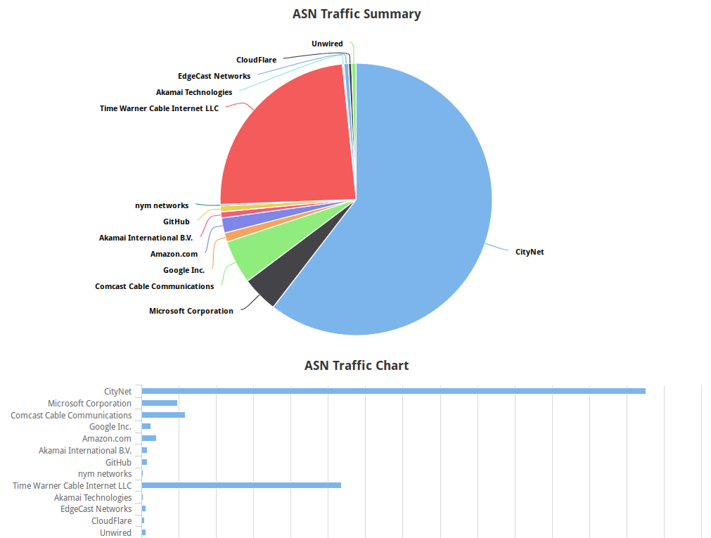

asn_report
==========

Description
-----------

``asn_report`` is a small Flask application that parses traffic destined to the 
internet and displays a chart of to get an idea of which ASes you send more to.

It's composed of two things: 

    1. Python utility that collects or captures traffic, parses, and stores
       into database. Scapy is used for live capture and currenly netflow v5
       is supported for collecting.

    2. Flask web application that reads from the database and creates a couple
       charts in javascript with the help of `chartkick`_.

.. _chartkick: https://github.com/mher/chartkick.py

Installation and Usage
----------------------

``asn_report`` is very easy to install. Just make sure you have git installed
and::

    git clone https://github.com/coxley/asn_report
    pip install -r requirements.txt .

Usage is pretty straightforward. There are two binary files that will be
installed into your environment.

To start storing traffic info into database, follow the usage doc for
``asn_capture``::

    asn_capture

    Description: Performs AS lookup for the destination of every packet processed
                 and stores in database for later viewing in web summary.

                 Traffic can either be gathered via a live capture with custom
                 filter (pcap) or via netflow by sending flows to the process
                 (flow).

    Usage:       asn_capture (pcap|flow) [options]

    Options:

        --help                          Show usage
        -f --filter=<pcap_filter>       PCAP filter syntax. Passed directly to
                                        scapy. [default: ip]
        --nflow=<flow_version>          Version of netflow to collect. Currently
                                        only 'v5' is supported. [default: v5]
        -h --host=<host>                IP address to bind flow collector on
                                        [default: 0.0.0.0]
        -p --port=<port>                Port to listen on for flow collector
                                        [default: 2303]

Capture should be started before webserver because it will initialize the db if 
it doesn't exist yet. If using netflow, once started feel free to start pushing
flows to it from your router, fw, etc!

To start the webserver to easily look at summary of the data::

    asn_report

That should spawn a local webserver reachable via http://localhost:5000/

For the graphing, you have the option to display each AS the following ways:

1. AS[num]. This is the default way.

2. AS[num]: [owner_string]. This is what I called 'display name'. To enable
   this provide ``--display-name`` as the only argument to ``asn_report``

3. [owner_string]. I assumed that the display name could get pretty long so 
   this final option is if you just want the name to show without the AS. To
   enable it, provide ``--owner`` as the only argument to ``asn_report``

Side Notes
----------

Only Netflow v5 is supported because I haven't been able to find a v9, sflow,
or ipfix collector written in Python. Netflow v5 is pretty simple and I was
able to find a few examples already written to tweak. Who knows, maybe at some
point I'll fill the gap.

--

There are two offline databases that may need updating from time to time. These
were chose to greatly speed up lookups and not to bog down other people's
services.

First is the database used by the pyasn module. This is a converted version of
a RiB snapshot taken from a looking glass. It's about 12MB and maps AS to IP
prefixes.

Second is the MaxMind Organizational CSV. This one maps AS to Org names and is
about 12MB as well unzipped.

To update these files, the easiest way is to just reinstall by grabbing the
repo again and making sure you have git install as well as ``unzip``. Then
before installing with pip, run the ``update-databases.sh`` script. This will
download and convert/extract both databases and then add them to git repo so
setuptools notices them.

--

The main object ``asn_report`` is a custom class ``ASNLookup`` that glues
together a lot of these for easy back and forth.

As of right now, the DB schema looks like:

+------------+---------------------------------------------+
| ASN        | AS advertising prefix                       |
+------------+---------------------------------------------+
| Owner      | Name of Owner                               |
+------------+---------------------------------------------+
| Host       | /32 host that packet was destined to        |
+------------+---------------------------------------------+
| Parent_pfx | Parent prefix of the host which is actually |
|            | being advertised.                           |
+------------+---------------------------------------------+
